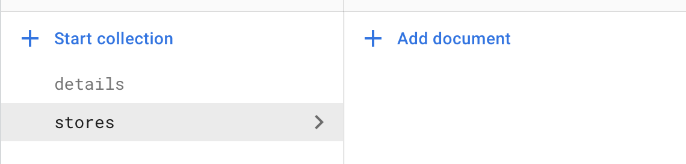
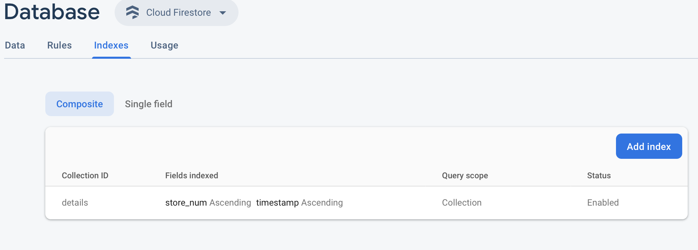

# Firebase POC

### Create Empty Collections [details and stores] via Firebase console.


### Create Index via Firebase console.


### Install Python requirements
```bash
pip3 install -r requirements.txt
```

Add json file to app directory as demo.json

### Create init data
```bash
python3 app.py create
```

### Populate Store data
```bash
python3 app.py populate
```

### View Store Counts
```bash
python3 app.py store_counts
```

### View Store Details
```bash
python3 app.py store_details 0
```

### Reset Data
```bash
python3 app.py reset
```

### Enter Store
```bash
python3 app.py enter_store 0 
```

### Exit Store
```bash
python3 app.py exit_store 0 
```

